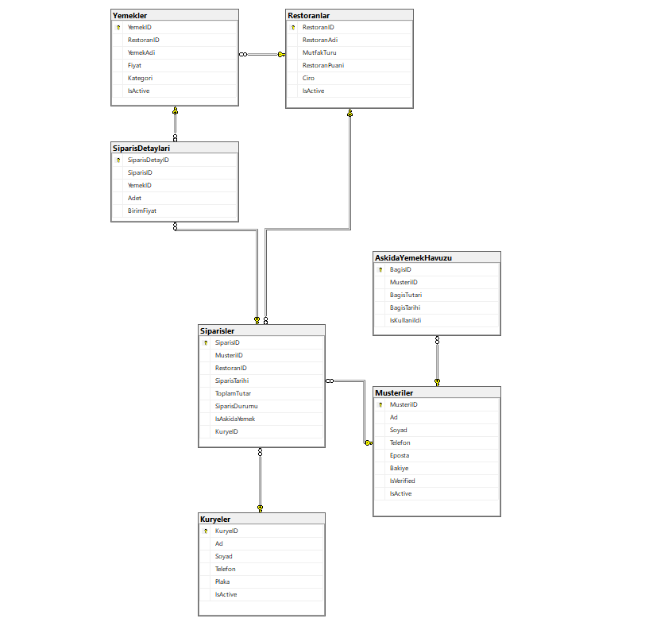

# 🍔 Askıda Yemek - Relational Database Management System

Bu proje, modern bir çevrimiçi yemek sipariş platformunun arka planında çalışan, **3. Normal Form'a (3NF)** uygun olarak tasarlanmış ilişkisel bir veritabanı (RDBMS) mimarisidir. 

Sistem, standart e-ticaret süreçlerine (müşteri, restoran, kurye, sipariş yönetimi) ek olarak sosyal sorumluluk odaklı **"Askıda Yemek"** modülünü barındırmaktadır.

## 🚀 Öne Çıkan Mühendislik Özellikleri (Key Features)

* **Referansal Bütünlük (Referential Integrity):** Tablolar arası `FOREIGN KEY` kısıtlamaları ile veri tutarlılığı güvence altına alınmıştır (Örn: Aktif siparişi olan bir kurye sistemden silinemez).
* **Otomatize İş Kuralları (Triggers):** * `trg_CiroEkle`: Sipariş "Teslim Edildi" statüsüne geçtiğinde restoranın toplam cirosunu otomatik günceller.
  * `trg_HavuzdanKullan`: Askıda yemek siparişlerinde, havuzdaki en eski (FIFO) bağışı bularak statüsünü günceller ve bakiye kontrolü yapar.
* **Veri Güvenliği (Constraints):** `CHECK`, `UNIQUE` ve `DEFAULT` kısıtlamaları ile mantıksız veri girişi (Örn: Eksi tutarlı sepet, 5'ten büyük restoran puanı) engellenmiştir.
* **İzlenebilirlik (Views):** Karmaşık `JOIN` işlemleri `vw_AskidaYemekHavuzDurumu` gibi görünümlerle (View) basitleştirilerek raporlamaya hazır hale getirilmiştir.

## 🗺️ Varlık-İlişki (ER) Diyagramı

Aşağıdaki diyagram, veritabanının fiziksel mimarisini ve 1:N (Bire-Çok) ilişkilerini göstermektedir:

## 💻 Kullanılan Teknolojiler

* **Veritabanı Motoru:** Microsoft SQL Server (T-SQL)
* **Geliştirme Ortamı:** SQL Server Management Studio (SSMS)
* **Mimari:** İlişkisel Veritabanı Modeli (RDBMS)

## 📌 Geliştirme Aşamaları (Roadmap)
- [x] Temel veritabanı mimarisinin (Tablolar ve Kısıtlamalar) kurulması.
- [x] İş kurallarını otomatize eden Trigger ve View'ların yazılması.
- [ ] *Yakında:* Sisteme "Soft Delete" (IsActive) mantığının entegre edilmesi.
- [ ] *Yakında:* Test verilerinin (Mock Data) yüklenmesi ve ileri düzey analitik sorguların (Subquery, Group By) oluşturulması.
